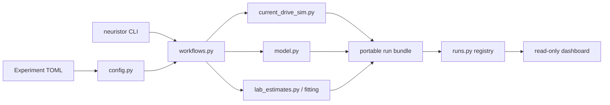

# Architecture

The codebase separates scientific truth, orchestration, and presentation so terminal
commands and the dashboard cannot drift into different models.

## Layer responsibilities

### Physics

`model.py` and `current_drive_sim.py` integrate the equations and own hysteresis
state. They do not know about TOML, Typer, Streamlit, Git, or output directories.

### Analysis

Fitting, digitization, and laboratory estimate modules operate on numerical arrays or
data frames. They expose reusable functions rather than command-line parsing.

### Workflow

`workflows.py` resolves presets, converts named user units to SI, calls one scientific
function, produces canonical metrics and plots, and completes or fails a `RunBundle`.
Sweep points call the same single-run evaluator, preventing a separate sweep model.

### Interface

`cli.py` parses terminal arguments and reports output paths. `dashboard.py` reads
existing records through `RunRegistry`. The dashboard cannot create a simulation;
this is a deliberate reproducibility boundary.

## Compatibility boundary

The dashboard registry normalizes two on-disk formats:

- new `run.json` bundles under `runs/` and `public_jobs/`;
- historical `job.json` directories under `jobs/` and `public_jobs/`.

This lets the UI improve without rewriting historical evidence. The old simulation
UI and one-off scripts remain recoverable at `v0.1.0-working-baseline`.

## Failure behavior

A workflow creates its manifest with status `running`. On success it registers every
artifact and changes status to `completed`. If orchestration raises an exception, it
records the exception type and message and marks the bundle `failed` before
re-raising. This makes interrupted work visible without mistaking it for evidence.
