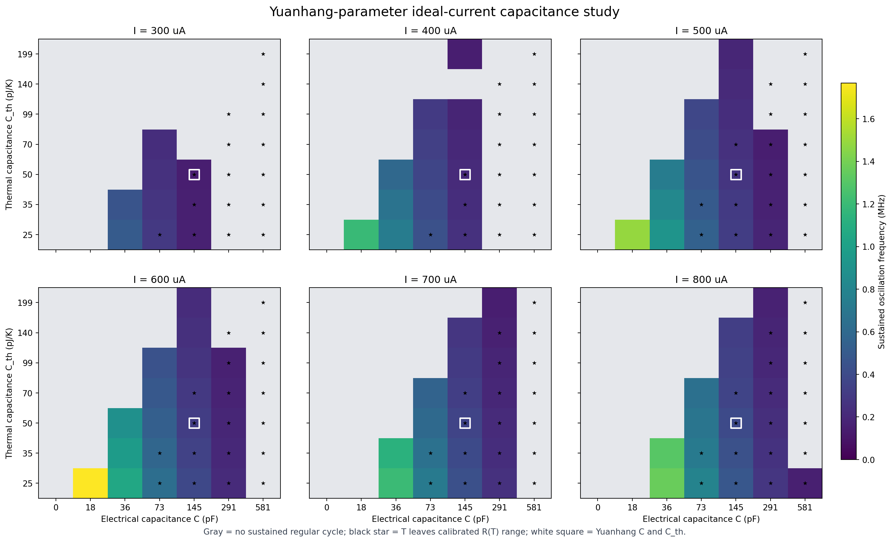
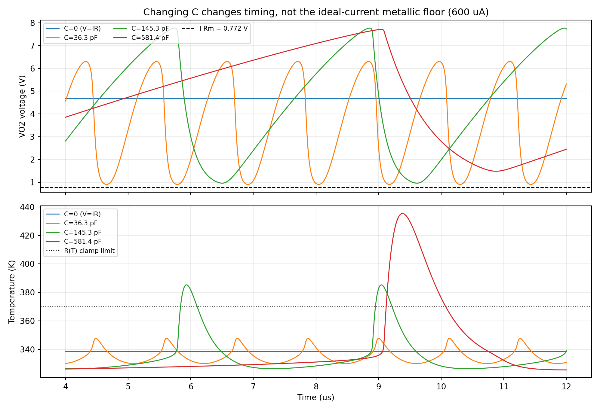
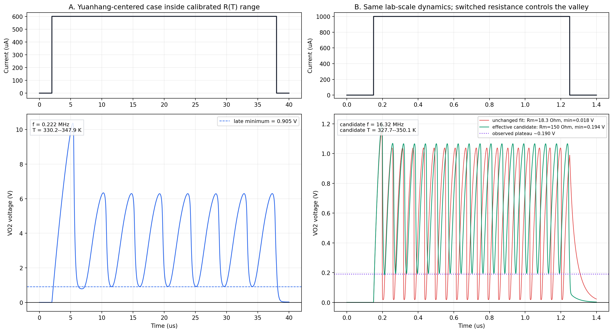

# Current-drive model audit and calibration notes

## What Yuanhang's original implementation actually simulates

The vendored upstream model is a voltage-source circuit, not an ideal-current circuit. A source voltage drives a VO2 device through a load resistor, with a capacitance from the VO2 node to ground:

\[
C\frac{dV}{dt}=\frac{V_{in}-V}{R_{load}}-\frac{V}{R_{VO2}(T,\mathcal H)}.
\]

Its single-device thermal equation is

\[
C_{th}\frac{dT}{dt}=\frac{V^2}{R_{VO2}}-S_e(T-T_0).
\]

The upstream numerical units are ns, kOhm, pF, mW, and mW ns/K. The corresponding baseline values in `references/yuanhangzhang98-collective_dynamics_neuristor-217d4f0/model.py` are:

| Parameter | Yuanhang value | SI value |
|---|---:|---:|
| Load resistance | 12 kOhm in `main.py` | 12 kOhm |
| Electrical capacitance | 145.346 pF | 145.346 pF |
| Thermal capacitance | 49.6278 mW ns/K | 49.6278 pJ/K |
| Total thermal conductance | 0.205587 mW/K | 0.205587 mW/K |
| Ambient temperature | 325 K | 325 K |
| Metallic resistance | 1286.317 Ohm | 1286.317 Ohm |

For an array, the reference code partitions thermal conductance into an environmental term and a nearest-neighbor term. For a single device there is no measurable neighbor coupling. Use `couple_factor=0` and interpret `S_e` as the device-to-substrate/environment conductance.

## The derived ideal-current model in this repository

The lab-oriented current-source extension uses

\[
C\frac{dV}{dt}=I_{in}(t)-\frac{V}{R_{VO2}(T,\mathcal H)},
\]

with the same thermal equation. A resistor in series with a mathematically ideal current source does not change the injected node current. If the real source has finite compliance, finite output resistance, cables, contacts, or a measured voltage that includes other elements, those must be modeled explicitly; they are not represented by the ideal-current equation.

## Why the simulated voltage falls close to zero

During a current pulse, the electrical fixed point at a given resistance is

\[
V_{ss}=I R(T).
\]

After switching, its lower bound is approximately `I*Rm`. Electrical capacitance controls how quickly voltage approaches this value, not the value itself.

At 400 uA:

| Resistance choice | Rm | Ideal-current floor `I*Rm` |
|---|---:|---:|
| Yuanhang reference | 1286.3 Ohm | 514.5 mV |
| Fitted specimen preset | 18.3 Ohm | 7.3 mV |
| Prior nonzero-valley trial | 250 Ohm | 100 mV lower bound; about 159 mV after settling |

Therefore, decreasing `C` cannot prevent the voltage valley. It makes the drop faster. The main causes of the mismatch are the fitted specimen's very low metallic resistance and uncertainty about which physical voltage the oscilloscope includes.

The professor-supplied numerical waveform family supports this diagnosis. Above
350 uA, plateau `V/I` ranges from about 205 to 480 Ohm, while the fitted `Rm` is only
18.2 Ohm. Because the plateau stays near 190 mV over a broad current range, one fixed
added series resistance is also insufficient to reproduce the whole family; the
temperature-dependent state and/or nonideal source/measurement circuit matters.

### Evidence: measured plateau versus the ideal-current floor

The replacement numerical bundle contains the
[measured parameter overview](../public_jobs/20260817_134254_lab-current-trace-parameter-estimates_4223e0/figures/parameter_estimates.png)
and [voltage-floor comparison](../public_jobs/20260817_134254_lab-current-trace-parameter-estimates_4223e0/figures/voltage_floor.png).
The red line is the fitted specimen prediction `V=I*18.3 Ohm`; it stays near zero
compared with the measured numerical plateau. Yuanhang's much larger metallic
resistance produces a much larger floor, while a fixed 250 Ohm addition crosses the
data only locally and cannot reproduce the nearly current-independent 190 mV plateau.
None of these steady-state lines depends on electrical capacitance.

## Model and numerical corrections made in this audit

1. The current solver now advances the frozen-resistance RC equation with its exact exponential solution. This remains bounded and nonnegative when `C` is small even if `dt` is longer than `R*C`.
2. `C=0` is now a real algebraic limit, `V=I_in*R(T)`. It is no longer silently replaced by 1 pF.
3. The deterministic cooling term is also advanced by its frozen-power exponential solution. Timestep convergence is still required because resistance and hysteresis change during a step.
4. The active hysteresis implementation previously clipped every reversal fraction to `[1e-6, 1-1e-6]`. This changed a valid upstream minor-loop resistance by as much as 56.8%. It now regularizes exact endpoints only and matches the upstream float32 trace to about 0.001 Ohm. The old 1e-6 convention remains isolated in `SampleFitHysteresisArray` so saved fit metrics still replay exactly.

The low voltage predicted with the 18.3 Ohm specimen `Rm` is not itself a numerical error. The former explicit Euler update could add artifacts when `C` was reduced, but a stable integrator cannot raise the physical `I*Rm` floor.

## Cth-versus-C frequency sweep with Yuanhang values

The checked-in `experiments/sweeps/current_capacitance_map.toml` recipe evaluates a
current-faceted grid centered on Yuanhang's `C` and `C_th`, at 300, 400, 500, 600,
700, and 800 uA. The archived figure below used the denser pre-refactor 7 by 7 recipe;
its exact generator remains in `legacy_scripts/sweep_current_capacitances.py` and the
working-baseline tag. Both workflows exclude startup behavior from cycle metrics.

At the nominal Yuanhang capacitances:

| Current | Frequency |
|---:|---:|
| 300 uA | 0.147 MHz |
| 400 uA | 0.218 MHz |
| 500 uA | 0.274 MHz |
| 600 uA | 0.321 MHz |
| 700 uA | 0.362 MHz |
| 800 uA | 0.397 MHz |

The nominal 600 uA result changes from 0.32101 MHz at `dt=1 ns` to 0.32138 MHz at `dt=0.25 ns`. A fast corner (`C=18.17 pF`, `C_th=24.81 pJ/K`, 600 uA) changes from 1.7673 to 1.7725 MHz between `dt=0.5 ns` and `0.125 ns`.

The sweep shows three useful trends:

- Increasing `C_th` generally lowers the frequency.
- Reducing finite `C` can make cycles faster, but removing the electrical state entirely stops the Yuanhang-parameter oscillation.
- When the metallic electrical time `Rm*C` is much longer than `C_th/S_e`, most tested cells settle, but this ratio alone is not a universal stability criterion; current and the full hysteretic trajectory also matter.



The white square marks Yuanhang's nominal electrical and thermal capacitances. The
gray `C=0` column corroborates that the algebraic thermal-only limit does not sustain a
regular cycle here. Moving to smaller finite `C` can raise frequency, but many such
cells leave the calibrated `R(T)` temperature range, marked by black stars.



The trace comparison makes the distinction explicit: finite `C` changes charging and
discharging timing and therefore cycle frequency; it does not change the metallic
steady-state bound `I*Rm`. The `C=0` case removes electrical memory and settles.

## Direct current-input versus voltage-output examples



Panel A gives a Yuanhang-centered oscillation whose voltage stays above approximately
0.85 V and whose temperature remains inside the published `R(T)` calibration range.
Panel B holds the lab-scale dynamics fixed and changes only the switched resistance:
the fitted 18.3 Ohm control falls to approximately 18 mV, whereas an explicit effective
150 Ohm candidate bottoms near the observed 190 mV plateau while retaining sustained
oscillations. The candidate is a circuit/device hypothesis, not a refit of intrinsic
metallic resistance. Full parameters and metrics are stored beside the figure.

Cells that drive temperature outside the 305--370 K calibrated resistance range are marked with `*`. In those cells the model clamps `R(T)` and the result is an extrapolation.

## Can the system oscillate with only thermal dynamics?

For `C=0`, voltage is algebraic and power becomes `P=I^2 R(T)`. A simple thermal-cycle estimate requires both:

\[
I > \sqrt{\frac{S_e(T_{heat}-T_0)}{R_{heat}(T_{heat})}}
\]

to heat through the upper transition, and

\[
I < \sqrt{\frac{S_e(T_{cool}-T_0)}{R_{cool}(T_{cool})}}
\]

to cool through the lower transition.

For Yuanhang's values these estimates are about 382.8 uA and 198.6 uA, respectively. Since the required lower current is greater than the allowed upper current, there is no overlap. The simulated `C=0` column likewise settles for every tested current and `C_th`. Finite electrical memory is essential for the oscillations found in this parameter set.

## Estimates from the numerical laboratory waveforms

The 22 converted traces contain the measured time, input current, and output voltage;
no values are recovered from images. They cover 41.9--943.3 uA. A conservative
periodic-peak detector identifies coherent oscillations from 233.5 to 621.8 uA at
41.7--62.5 MHz, reproducing the operating range reported in Figure 7.
The [archived sweep summary](../public_jobs/20260817_134254_measured-laboratory-current-sweep_a45254/figures/lab_summary.png)
shows average output voltage, maximum output power, and detected frequency directly
from those files.

### Electrical capacitance

Before switching and near `V=0`, `dV/dt` is approximately `I/C`, so

\[
C\approx\frac{I}{dV/dt}.
\]

Four clean pre-switch traces give 18.5--21.4 pF, with a median of 19.8 pF. This is
much smaller than Yuanhang's 145.35 pF. The estimate uses the measured current step,
not the nonzero oscilloscope baseline.

### Switching current and environmental conductance

The numerical family brackets switching onset between 195.3 and 233.5 uA. Using the
last pre-switch point (`V=316.0 mV`, `P=61.73 uW`) and the fitted specimen heating
midpoint `T_switch=336.93 K`:

| Assumed T0 | Estimated Se |
|---:|---:|
| 298 K | 0.00159 mW/K |
| 325 K | 0.00517 mW/K |
| 330 K | 0.00890 mW/K |
| 333 K | 0.01569 mW/K |

This strong dependence is why ambient temperature must be measured rather than absorbed freely into `S_e`.

### Thermal capacitance

Electrical waveforms do not independently identify `C_th`. First measure the thermal
recovery time from a post-pulse or pump-probe trace, then calculate

\[
C_{th}=S_e\tau_{th}.
\]

For example, if `T0=325 K`, the onset estimate gives `S_e=0.00517 mW/K`; thermal
recovery times of 20, 50, and 100 ns imply `C_th=0.103`, `0.259`, and `0.517 pJ/K`.
This illustrates that waveform fitting often identifies the ratio `C_th/S_e` more
strongly than either parameter alone.

### What the waveforms can tell us about gamma

`gamma` changes the curvature of minor hysteresis loops after a temperature reversal.
The oscillatory traces contain many such reversals, so they can constrain one shared
specimen value once the thermal trajectory is known. For a calibrated electrical
capacitance,

\[
I_R=I_{in}-C\frac{dV}{dt},\qquad P=V I_R.
\]

With independently constrained `T0`, `S_e`, and `C_th`, integrating the thermal
balance reconstructs `T(t)`, and `gamma` can be fitted globally to the measured
`R(t)=V/I_R` cycles. Without those thermal constraints, changes in `gamma` can be
compensated by changes in the latent temperature trajectory, so a fitted value would
not be independently identifiable. Apply the resulting value across current traces
from this same specimen; transferring it to another specimen requires validation.

## Recommended calibration order

1. Record the exact stage/substrate ambient temperature and clarify whether measured voltage is across VO2 only or includes contacts, leads, sense resistance, or source compliance.
2. From a low-current, nonswitching edge, fit `tau_el` and use `C=tau_el/R` (or the early-slope approximation above).
3. From a post-pulse or pump-probe recovery, fit `tau_th`.
4. Use power immediately before switching and the measured `T0` to estimate `S_e=P_switch/(T_switch-T0)`.
5. Calculate `C_th=S_e*tau_th`.
6. Fit `Rm` and any explicit contact/source model to the measured switched-state voltage floor. Do not use `C` for this purpose.
7. Only after these steps, refine current amplitude, transition temperature, and hysteresis width against the full waveform and repeat at smaller `dt`.

## Reproduction commands

```bash
neuristor simulate current \
  --config experiments/current/nonzero_voltage_valley.toml
neuristor sweep run \
  --config experiments/sweeps/current_capacitance_map.toml
neuristor analyze estimates \
  --data data/experimental/tia_current_sweep \
  --resistance-preset presets/resistance_100425_chip1_gap3.json
pytest -q
neuristor validate
```

New outputs are standard bundles under `runs/`. Use `neuristor runs publish RUN_ID`
to copy reviewed evidence into the Git-tracked `public_jobs/` archive. The former
screenshot-digitization code and its derived artifacts were removed; Git history is
their recovery path.
