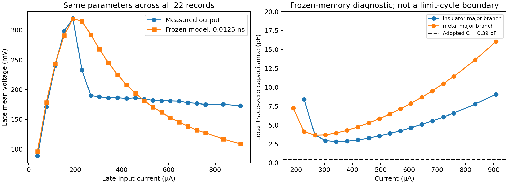

# Simulation discrepancy audit — 21 September 2026

The current-source mismatch survives unit checks, fresh simulation and timestep
refinement. A real small-capacitance bug was fixed in the **voltage-source**
solver, but it did not generate the archived current-source discrepancy.
The leading unresolved explanations are the active circuit's measurement/feedback
dynamics and transferring a uniformly heated R(T) curve to a localized driven
filament with fixed thermal parameters. Neither has been uniquely established.

Gabriel confirmed during this audit that the R(T) sweep came from the **same
device**. A wrong-device explanation is therefore unsupported. A complete TIA
schematic is unavailable; identical mounting and calibrated terminal-channel
definitions have not been confirmed. Existing uncommitted research work was
preserved. No experimental data, fitted preset or old public bundle was changed.

## Implementation and units

Reviewed the authoritative voltage and current solvers, hysteresis and upstream
fidelity notes, configuration conversion, numerical CSV importer, thermal inverse
estimator, forward comparison, persistence detector, recipes and archived results.

| Check | Finding |
|---|---|
| pF and pJ/K to SI | Both multiply by 1e-12. The conversion is correct. |
| mW/K to W/K; ns to s | Factors 1e-3 and 1e-9 are correct. |
| Converted measurement power | mV × µA / 1000 gives µW; correct. |
| Displacement current | pF × mV/ns gives µA; correct. |
| Inverse thermal time | (pJ/K)/(mW/K) gives ns; correct. |
| Resistance convention | `R0` is an Arrhenius prefactor; actual metallic resistance is `Rm0*Rm_factor`. No missing factor was found. |
| Current circuit | `C Vdot = I - V/R`, `Cth Tdot = V²/R - Se(T-T0)`; Joule heat uses resistive power. |
| C=0 | Algebraic `V=IR`, not division by a tiny surrogate C. |
| Hysteresis | Float32 branch memory and reference ordering preserved. |
| Analysis labels | Source-setting mV are identifiers, not the imposed measured µA. Persistent-cycle metrics are used rather than early peak counts. |

**Fixed:** `YuanhangArraySimulator` used `max(capacity_SI, 1e-12)` for both
electrical and thermal capacitance. A supplied 0.39 pF became 1 pF, and
0.047873 pJ/K became 1 pJ/K—factors of 2.56 and 20.89. This is a physical
parameter alteration, not harmless numerical regularization. Positive finite
values now pass through unchanged; invalid values raise an error. The
current-source solver already used the actual values. The existing uncommitted
current-source diagnostic-floor correction was retained, not counted as a new fix.

An independent constant-resistance analytic reference verifies both RC voltage
and its time-dependent Joule heating at 0.005, 0.0025 and 0.00125 ns. Both errors
decrease at each refinement; finest maximum errors are below 0.5 mV and 0.005 K.
The test would fail with the old capacity floors. This preserves the upstream
hysteresis algorithm and the normal Yuanhang capacities, which exceed the floors.

## Fresh numerical evidence

The [new audit bundle](../public_jobs/20260921_124525_independent-units-stability-and-specimen-replay-_ffaded/report.md)
contains the exact reproduction script, inputs, source hashes, dirty-tree patch,
tables and figure. All 22 baseline-corrected input histories are retained from
their first recorded sample, including 296 ns before the pulse. Analysis uses
150–250 ns; persistence uses the existing four-window audit.

At **0.05, 0.025 and 0.0125 ns**, the frozen model predicts **zero persistent
records**, versus **11 measured**. At the finest step, across-current late-mean
voltage RMSE is **45.33 mV**. The largest late-mean change between the last two
steps is **0.266 mV**. This bounds the tested mean-voltage discretization error;
it does not prove exact phase convergence or convergence of other fitted vectors.
Temperatures span 314.40–341.30 K, within the specimen resistance domain.

| Late current (µA) | Measured mean (mV) | Predicted mean (mV) | Measured / predicted periodic Vpp (mV) |
|---:|---:|---:|---:|
| 190.10 | 319.47 | 319.34 | 1.39 / 0.19 |
| 228.72 | 232.71 | 314.90 | 91.63 / 0.42 |
| 381.40 | 186.26 | 225.31 | 45.30 / 0.09 |
| 606.58 | 180.88 | 153.01 | 6.23 / 0.14 |
| 907.91 | 172.88 | 108.80 | 5.99 / 0.11 |

Small periodic components do not alone establish persistence. The 190 µA agreement
is partly calibration reuse: the neighboring pre-onset state determined Se.



## Why the present parameters settle instead of oscillating

This is a new **local, frozen-memory diagnostic**, not a replacement model or a
proof about every hysteretic trajectory. On a smooth resistance branch, at a
constant-current equilibrium `V*=IR*`, `I²R*=Se(T*-T0)`, write `R'=dR/dT`.
Linearizing the two existing physical equations gives

\[
J=\begin{pmatrix}
-1/(CR_*) & IR'/(CR_*)\\
2I/C_{th} & (-I^2R'-S_e)/C_{th}
\end{pmatrix}.
\]

For decreasing resistance, the determinant `(Se-I²R')/(C Cth R*)` is positive.
The trace changes sign, when `-I²R'>Se`, at

\[
C_{\mathrm{crit}}=\frac{C_{th}}{R_*[-I^2R'-S_e]}.
\]

The authoritative resistance evaluator on fresh heating and cooling major
branches gives a minimum **2.80 pF** across the measured current settings.
All those equilibria are locally stable at **0.39 pF**. Heating-branch scales
near 228, 381 and 607 µA are approximately **8.6, 2.9 and 4.6 pF**.
Repeating the derivative with 0.01, 0.02 and 0.04 K halfwidths changes finite
thresholds by less than 0.3%. Hysteresis reversals, minor branches and large
excursions are omitted, so these are not full-system Hopf or limit-cycle boundaries.
They independently explain why the existing larger-C searches change stability.

At C=0 on a fixed smooth branch, the local temperature relaxation rate is
`(I²R'-Se)/Cth < 0`. Changing Cth changes the rate, not this sign. Its relaxation
time is **Cth/(Se-I²R')**, not simply Cth/Se. Therefore a measured 20 ns period
cannot be equated directly to the fitted 13 ns bare thermal time. Discontinuous
switching or another dynamical state can change this conclusion; no claim that
all current-driven thermal oscillators are impossible is intended.

## Literature and circuit clues

The experimental [Gildor et al. preprint, Methods B](https://arxiv.org/pdf/2604.04594)
identifies an LT1228 transconductance stage and an active TIA/protection circuit.
Its reported geometry is approximately 200 nm gap and 150 nm film thickness.
It also distinguishes uniform thermal switching from localized electrically
driven filaments. Same-device static thermometry consequently does not establish
the driven spatial temperature or conducting cross-section.

The [LT1228 datasheet, p. 11](https://www.analog.com/media/en/technical-documentation/data-sheets/1228fd.pdf)
specifies approximately **5 pF at ±15 V or 6 pF at ±5 V** at the transconductance
output, before board/socket capacitance. Its transconductance bandwidth depends
on set current; headline bandwidth is 75 MHz. These scales overlap the observed
40–60 MHz and the historical effective C=6.8355 pF. **That is a topology-dependent
clue, not proof that 6 pF is across VO₂ or that the chip creates the oscillations.**
The common-base stage may isolate that capacitance. Do not insert it into the
ideal device model without identifying its node and impedance transformation.

[Carapezzi et al. (2023)](https://doi.org/10.1088/2634-4386/acf2bf)
model spatial electrothermal dynamics and show that intermediate resistance
states and heat transfer can move dynamic switching points away from static
ones. Their material inputs include volumetric heat capacity about
**3×10⁶ J m⁻³ K⁻¹** and thermal conductivity **6 W m⁻¹ K⁻¹**; their particular
geometry yields effective heat-loss conductance about **1.08 µW/K**. These are
material/geometry plausibility references, not transferable specimen parameters.

Using that heat capacity, our Cth implies a VO₂-only volume of **0.01596 µm³**.
At a 0.2 µm gap and 0.15 µm thickness, this corresponds to a **0.53 µm effective
width**. Thus the small number is not automatically a factor-of-1000 unit error.
The measured device width, substrate participation and transition enthalpy are
needed to interpret it; this calculation does not measure a filament width.

[Pollner et al.](https://arxiv.org/abs/2506.01139) demonstrate VO₂ oscillators
into the 100 MHz range and explicitly study circuit propagation and internal
resistance relaxation. Their results support measuring the circuit and switching
time scales separately; their device geometry and fitted constants should not
be substituted for this sample's constants.

## A physically motivated explanation of the high-current plateau

This is an inference to test. The measured output remains near 0.18 V while
current roughly triples. A metallic filament can accommodate extra current by
widening: `R_f=ρ_m L/A_f`. If heat loss also scales approximately with width,
`Se_f∝A_f`, and its active temperature stays near a transition, steady balance
`I²ρ_m L/A_f∝A_f ΔT` implies `A_f∝I`, hence approximately constant `IR_f`.
The present fixed-volume, single-temperature R(T) law has no independently
evolving filament cross-section and need not reproduce this behavior.

The same-device fully metallic 18.2 Ω is then a whole-bridge endpoint, not
necessarily the resistance of the driven filament. Apparent 190–298 Ω could
correspond roughly to 6–10% of the full metallic cross-section if contacts and
background conduction were negligible. This is only a scale argument conditional
on terminal V and I, not an extraction of metallic fraction. Active feedback
can also produce a plateau, so the plateau alone does not choose this mechanism.

Increasing a fixed series resistance cannot reproduce the falling high-current
voltage; increasing only Se was already tested and fixes one current while
worsening others. A scalar gamma adjustment cannot establish spatial heating,
filament relaxation, or an amplifier transfer function.

## Re-estimate parameters in an identifiable order

| Priority | Measurement | What it determines / discriminates |
|---|---|---|
| 1: circuit calibration | Replace VO₂ with known resistors spanning about 200 Ω–2.5 kΩ. Measure gain and phase across roughly 1–200 MHz and pulse response with the same probes. Record both device-terminal nodes, input monitor and amplifier output where accessible. | Board transfer, ringing, delay, current split and capacitance location. A dummy that rings near 50 MHz points to a circuit contribution; a clean dummy alone does not rule out nonlinear loop instability with VO₂. |
| 2: cold electrical response | Below switching, fit complex admittance versus frequency and temperature after fixture/probe correction. | A device parallel C contributes `Im(Y)=ωC`. Do not infer a universal C upper bound from the source-limited edge or a 1 ns sampling interval alone. |
| 3: heat loss and thermal mass | At several ambient temperatures and nonswitching biases, use calibrated device power and an independent temperature observable where possible. Measure heating and cooling with the known electrical transfer removed. | Joint Se and Cth, electrothermal feedback and evidence for multiple thermal times. A fitted pole under bias is not automatically Se/Cth. |
| 4: driven state | Measure minor R(T) loops and subthreshold probe resistance after switching pulses; vary current, pulse width (e.g. 300 ns and 1 µs) and recovery delay. Add spatial thermometry/imaging if available. | Gamma/minor-loop geometry versus a separate evolving filament or phase fraction, and persistence beyond the present short record. |

Retain the measured static R(T) parameters as same-device evidence. Treat
Se=3.675 µW/K and Cth=0.047873 pJ/K as a **correlated conditional estimate**,
not independent hard material bounds. Treat C=0.39 pF as a **conditional timing
inference**, not established total board/device capacitance. Gamma is unmeasured.
Use literature heat capacity and conductivity with measured geometry to form
priors; infer effective conductance from geometry, interfaces and measured heat
loss, rather than copying another device's lumped Se.

If the calibrated circuit explains the response, add its actual nodes and
transfer dynamics as a separate circuit model. If a residual device mismatch
remains, the next economical model is one measured phase/filament state with
conductance and heat loss dependent on its extent. Any transition enthalpy must
enter the energy balance consistently. Fit that state to switching/recovery
data first, then test one shared parameter vector against the entire current
sweep. Do not add arbitrary per-current parameters or promote a better waveform
fit as proof of a mechanism. Future validation should use newly acquired settings,
because the historical held-out traces have now been inspected repeatedly.

## Verification and reproduction

- `pytest -q`: **61 passed** (52 pre-existing tests plus nine new regression cases).
- The exact checked-in voltage recipe completed after the fix.
- The exact specimen model-validation recipe completed and again found zero
  predicted oscillators, no oscillation within C≤0.39 pF, and 7 pF as its first
  oscillating grid value at the adopted Cth.
- All-current independent replay used two smaller timesteps as detailed above.
- `neuristor validate` checks recipes and published bundles after archival.

Run from the repository root:

```bash
pytest -q
neuristor validate
neuristor simulate voltage --config experiments/voltage/yuanhang_oscillator.toml
neuristor analyze model-validation --config experiments/current/specimen_model_validation.toml
python public_jobs/20260921_124525_independent-units-stability-and-specimen-replay-_ffaded/reproduce.py
```

Each numerical command creates a new run. The audit does not establish an error
in the experimental data, a unique root cause, or a replacement calibrated model.
