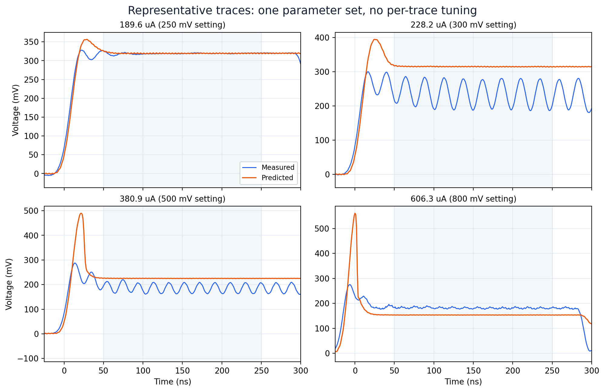

# Experimental TIA versus ideal-current neuristor: an auditable comparison

Prepared 18 September 2026 for discussion with Amir Gildor and Yoav Kalcheim.
This is a discrepancy report about a **specified simulation and interpretation of
recorded channels**, not a claim that the experimental observations are wrong.
No new specimen parameter set is adopted here.

## What can actually be reproduced

The [public experimental preprint](https://arxiv.org/abs/2604.04594v1) reports
measured TIA output, approximately 40–60 MHz oscillations over roughly
200–600 µA, and output-derived energy around 1.2–1.9 pJ per event (Figures 6–7
and Table 2). It gives a physical electrothermal explanation, but does **not**
specify a numerical neuristor simulation and parameter vector to reproduce.
Our July [paper-frequency analog](../public_jobs/20260707_145140_paper_frequency_f881d2/professor_paper_simulation_report.md)
is our own illustrative ideal-source simulation, not an undisclosed simulation
from that preprint. It oscillated at 1.4–2.1 mA and 35.7–60.7 MHz, with
36–54 pJ per cycle: matching the frequency scale did not match the measured
current or energy scale.
If Amir has a separate private simulation, an equivalent numerical run needs
its equations or netlist, parameter values and units, initial conditions,
source waveform, device and readout nodes, numerical step, and analysis window.
None of those can be inferred from Figure 6 alone.

The reproducible comparison is therefore: **feed each of the 22 supplied measured
current waveforms into one frozen ideal-current model**, then compare its sampled
output with the corresponding measured output. The authoritative results and
input configuration are the immutable [frozen validation bundle](../public_jobs/20260829_100718_specimen-model-prediction-versus-measured-curren_eefab7/)
and [recipe](../experiments/current/specimen_model_validation.toml). The
[persistence audit](../public_jobs/20260914_073330_sustained-oscillation-audit-and-three-current-ma_26ff13/)
corrects the earlier interpretation of oscillations as sustained based on peak
counts alone. Later fitted parameter sets are *diagnostic searches*, not substitutes
for the frozen prediction or genuine blind replications.

The three original Figure 6 workbooks correspond to the 100, 500 and 1000 mV
source-setting CSV records. Their raw late current levels are approximately
80.5, 388.6 and 791.4 µA, matching the figure's approximately 80, 390 and
790 µA labels. Their baseline-corrected 50–250 ns current steps are 76.17,
380.89 and 756.62 µA. The source settings are record identifiers. The workbooks'
second time column adds 150 ns for plotting; it is not measured channel delay.
The [channel audit](CHANNEL_CIRCUIT_AUDIT.md) checks the workbook conversions and
their agreement with the CSVs.

## Assumptions needed to call this the same experiment

| Assumption in the ideal-current replay | What supports it | What remains unverified |
|---|---|---|
| `C dV/dt = I_in − V/R(T,H)` and `C_th dT/dt = V²/R − S_e(T−T₀)` | Correct implementation of the specified ideal-source extension, tested Yuanhang hysteresis and timestep refinement | The TIA input, feedback branch, output stage and protection circuit do not necessarily reduce to these two states. |
| CH2-derived `Input Current` is the current entering the modeled VO₂–C branch | Workbook conversion is numerically consistent, approximately 794.33 µA per CH2 volt | Probe node, current-split transfer, sign, offset, loading and bandwidth were not exported. |
| CH1-derived `Output Voltage` is the VO₂ terminal drop | Workbook conversion is numerically consistent, approximately 1000 mV per CH1 volt | The paper calls it TIA output. Both simultaneous device-terminal voltages and calibrated channel skew are missing. |
| `V_out I_in` is VO₂ heat input | This is exactly how the exported output-power column and preprint calculate it | It is device Joule power only after the voltage/current boundary and capacitive contribution are established. |
| The measured 2 µA major R(T) loop describes the mounted driven device, including its local temperature and branch history | The static log-resistance fit is accurate on that measured loop | Transfer to a possible filament, contacts, nonuniform temperature and dynamic minor loops is untested; γ is borrowed from Yuanhang. |
| `T₀=314.4 K`, `S_e=3.675 µW/K`, `C_th=0.047873 pJ/K`, `C=0.39 pF` are hardware quantities | Conditional ambient, settled pre-onset, early-edge and timing analyses | The conductance uses static thermometry and assumed channel meaning; `C_th` moves −21% with a synthetic +2 ns current advance; `C` is an unresolved timing bound, not a positive measurement. |

Other frozen parameters come from the [sample R(T) preset](../presets/resistance_100425_chip1_gap3.json):
`R_m=18.215 Ω`, `T_c=333.494 K`, `w=6.882 K`, `β=0.2992 K⁻¹`,
`R₀=0.7989 Ω`, `E_a/k_B=2537 K`, and borrowed `γ=0.95627`. The model begins
at `T₀` on the insulating branch; the actual leakage and recovery state were
not observed at VO₂ terminals. The original current histories are retained
before the pulse; **only analysis channels are baseline corrected**.
Within the implemented model, varying starting temperature from 285 to 375 K
or choosing the opposite initial major branch changes any late mean by at most
0.144 mV and creates no oscillations, because the 296 ns prehistory spans
about 22.7 adopted thermal time constants. Ordinary modeled thermal initial
state is therefore not a viable explanation for the roughly 45 mV mean RMSE.
An unmodeled filament/phase memory state remains a separate hypothesis.

## Paper-anchored waveform comparison

The table evaluates the **same 150–250 ns late window** on the archived sampled
measured and frozen-model traces, with the documented
[`audit_voltage` metric](../src/neuristor/oscillation_audit.py). The robust span
is the 95th minus 5th voltage percentile. Periodic Vpp is the fitted dominant
sinusoidal component, not the raw peak-to-peak range. A frequency is meaningful
only when the component is appreciable; the flat predictions have none.

| Figure 6 panel / source label | Baseline-corrected input step (µA) | Measured late output mean (mV) | Frozen mean (mV) | Measured / frozen late periodic Vpp (mV) | Measured late frequency | Four-window persistence |
|---|---:|---:|---:|---:|---:|---|
| (a), 100 mV | 76.17 | 171.14 | 178.47 | 4.09 / 0.28 | No reliable oscillation | Neither passes |
| (b), 500 mV | 380.89 | 186.26 | 225.08 | 45.30 / 0.14 | 51.50 MHz | Measured passes; frozen fails |
| (c), 1000 mV | 756.62 | 174.86 | 127.16 | 3.48 / 0.12 | Small residual component; no sustained label | Neither passes |

Thus matching a low-current voltage does not establish the dynamics: at the
paper's middle panel, the frozen model is about 39 mV high in mean and lacks
the approximately 45 mV periodic output. At the high panel it is about 48 mV
low in mean. The sign change rules out a simple fixed output offset. Across
all 22 currents, the experiment has 11 nominal persistent oscillatory records
from approximately 228 to 606 µA; the frozen model has none. The nominal
thresholds are operational and a 300 ns pulse cannot establish an infinite-time
limit cycle. See the [full comparison table](../public_jobs/20260829_100718_specimen-model-prediction-versus-measured-curren_eefab7/comparison.csv)
and [sampled waveforms](../public_jobs/20260829_100718_specimen-model-prediction-versus-measured-curren_eefab7/comparison_traces.csv).

At the high Figure 6 panel, reading the output as a device-terminal drop would
give about 231 Ω from 174.86 mV / 756.62 µA. If the same mounted device were
fully metallic with the static fitted `R_m=18.215 Ω`, that current would give
about 13.8 mV across its resistive path. The approximately 13-fold ratio tests
the *combined* terminal map and transfer of static `R_m` to the driven state;
it does not contradict the measured TIA output or prove the film never switches.

### What the reported pJ number measures

The paper's approximately 1.2–1.9 pJ per oscillation is reproducible from the
supplied records when “energy per oscillation” means the integral of the **full
reported output-power trace** over one period. For the 11 nominally persistent
records, direct peak-to-peak integration over 150–250 ns gives median per-record
values from 1.159 to 1.754 pJ. The archived shortcut
`mean(V_out I_in) / frequency` agrees with those direct integrals to a median
1.30% and at worst 2.76% across the 11 records.

That number includes the nearly constant power dissipated between voltage
excursions. Subtracting each cycle's minimum power before integrating gives only
0.044–0.313 pJ, or 2.5–27.0% of the full-cycle value (median 9.3%). This is not a
correction to the paper: it distinguishes two different quantities. The first is
total output-derived energy per period; the second is the incremental modulation
above a within-cycle floor. Neither is yet an intrinsic VO₂ switching energy
unless the measured voltage and current are established at the device boundary.

The archived comparison below also shows the stable pre-onset control,
oscillatory onset, Figure 6 middle-panel record and approximately 607 µA
boundary on common time axes. It is not a plot of all three Figure 6 panels.



## Why the 607 µA resistance conflict is large

At the 800 mV source setting, recorded late output and current give an
**apparent** 298 Ω. Replaying the static hysteretic law on a temperature
trajectory calculated from the recorded channel product and adopted thermal
values gives about 30 Ω, or 26–34 Ω across tested γ values. That reconstructed
temperature is about 344.25 K; the major heating branch would give 298 Ω at
about 339.27 K. The frozen **forward** prediction is about 153 mV against
roughly 181 mV measured. Its roughly 28 mV mean error, when converted into
assumed heating power, shifts the thermal estimate by about 5 K near a steep
transition and magnifies the inverse resistance discrepancy. This is a
conditional inconsistency, not independent temperature evidence or proof of
a tenfold material-parameter error. The full [inverse bundle](../public_jobs/20260914_074731_conditional-hysteresis-reconstruction-from-measu_fa4b66/)
and [circuit audit](CHANNEL_CIRCUIT_AUDIT.md) give the waveforms and limitations.

Two broader checks avoid making the conclusion hinge on that one point. After
baseline correction, late output stays approximately 173–188 mV from 303 to
908 µA while `V/I` falls from 619 to 190 Ω. Assuming these are VO₂ terminal
quantities, the static heating branch and approximately steady balance would
require very different power-versus-temperature slopes: 4.64 µW/K from the
50→250 mV low-current pair and 55.31 µW/K from the 900→1200 mV high-current
pair. Their ratio stays 11.52–12.78 across 16 baseline/late-window choices
and 10.73–13.14 across the central 95% of 1000 paired static R(T) bootstrap
draws. At onset, apparent resistance **and** apparent power both decrease
from the 250 to 300 to 350 mV settings, contrary to one monotone static
near-equilibrium heating branch. These checks do not identify the cause:
the middle traces oscillate and the high traces retain small periodic output;
`R(mean T)` need not equal a cycle's apparent `mean(V)/mean(I)`.

## Explanations to test, without assigning blame

1. **Circuit and channel boundary.** A TIA output voltage is not automatically
   the VO₂ terminal voltage, and recorded source current is not automatically
   feedback-element current. The paper's schematic is conceptual, and the
   supplied exports lack synchronized terminal probes and CH2 calibration.
   This is the first measurement to resolve because it controls every inferred
   power, resistance and thermal parameter.
2. **Driven device state versus static R(T).** Partial filaments, contacts,
   local temperature gradients or relaxation could make the 2 µA major loop
   inappropriate under a 300 ns TIA pulse. The paper separately reports
   approximately 30 ns rise and resistance creep over about 300 ns on a
   different voltage-pulse board. These are candidate mechanisms, not values
   fitted to the TIA records.
3. **Thermal initial condition and time constants.** Conductance is anchored
   to one pre-onset record; capacitance and thermal capacity share the channel
   and timing assumptions. Changing only `S_e` can fix the 607 µA *mean*
   while worsening onset and high-current errors and leaving negligible cycles.
   The documented intervals are conditional and should not be treated as
   independent physical bounds.
4. **Electrical dynamics and minor-loop law.** A larger `C` or altered γ can
   create cycles in selected searches, but no physically supported shared
   candidate yet matches mean, amplitude, frequency and persistence. The
   reported `C=0.39 pF` is especially sensitive to uncalibrated channel delay.
   More degrees of freedom should follow measurements, not precede them.

Implementation and units remain testable alternatives, but the ideal-source
equations, unit conversions, mechanism control, archive validation and timestep
checks have not revealed a waveform-generating defect. One **diagnostic**
step-size denominator was corrected; it did not create the published frozen
waveform mismatch. The model and active TIA may simply have different
boundaries. None of these observations establishes an error in the colleague's
experiment or uniquely validates a new physical mechanism.

## Three decisions that would settle the route forward

| Priority and action | Decisive observation | Next modeling action |
|---|---|---|
| **1. Measure the circuit boundary.** With the Figure 6 board, record both VO₂ terminal voltages, CH2 monitor, TIA output and feedback current together at ~190, 267, 607 and 908 µA. Repeat with a known ~300 Ω feedback resistor and record channel delay, loading and pre-pulse leakage. | Does the device voltage/current product equal the exported `V_out I_in` at low, onset and high inputs? The 190/267 µA pair tests an approximately 10 µW apparent-power reversal. | If the map differs, model or correct the measured TIA transfer first; then re-estimate thermal parameters. |
| **2. Test the mounted device's state.** Measure its major and minor R(T), ambient temperature, and at least one independent driven temperature or calibrated thermal-response point. | At ~607 µA, does roughly 300 Ω coincide with a local temperature near 339 K or 344 K? | The first outcome points toward heat-loss/power assumptions; the second challenges the static, uniform R(T) law. |
| **3. Test duration and memory.** Repeat ~190, 228, 267, 607, 682 and 908 µA pulses for 300 ns and about 1 µs with ~100 and 500 ns recovery delays. | Do the voltage cycles persist and depend on previous pulses after circuit correction? | Only then introduce one measured relaxation/filament state and check a shared vector on held-out currents. |

Until those controls are available, present a **conditional discrepancy**:
the tested, physically anchored ideal-current model does not predict the
experimental TIA output across the sweep. Do not claim that a numerical
simulation in Gildor et al. was reproduced, that a parameter was measured
independently when it depends on the channel map, or that a visually periodic
transient is sustained.

## Reproduce the comparison

From the repository root, the reviewed frozen run can be regenerated without
editing its immutable bundle:

```bash
neuristor analyze model-validation --config experiments/current/specimen_model_validation.toml
neuristor analyze oscillation-audit --config experiments/current/specimen_oscillation_audit.toml
neuristor analyze reconstruct-hysteresis --config experiments/current/specimen_hysteresis_reconstruction.toml
```

The first command replays all 22 measured currents with the frozen specimen
vector; the second audits persistence and controlled exploratory candidates
(its map uses a different, anchored reference vector); the third performs the
conditional inverse test. Each writes a new ignored `runs/` bundle. Do not
replace these with a per-current fit when making the comparison.

The paper-panel table above is calculated directly from the immutable frozen
bundle's `comparison_traces.csv` using `audit_voltage` at the original 1 ns
sample times. A compact repeat command is:

```bash
python - <<'PY'
import pandas as pd
from neuristor.oscillation_audit import audit_voltage

path = 'public_jobs/20260829_100718_specimen-model-prediction-versus-measured-curren_eefab7/comparison_traces.csv'
traces = pd.read_csv(path)
for label in (100, 500, 1000):
    row = traces[traces.nominal_drive_mV == label]
    results = [audit_voltage(row.time_ns.to_numpy(), row[column].to_numpy())[0]
               for column in ('measured_voltage_mV', 'predicted_voltage_mV')]
    print(label, [(round(r['late_mean_mV'], 2),
                   round(r['late_periodic_vpp_mV'], 2), r['sustained'])
                  for r in results])
PY
```

Full assumptions, fit history, convergence, caveats and evidence links remain in
the [research handoff](RESEARCH_HANDOFF.md). No raw measurement or completed
public run was changed to produce this memo.
