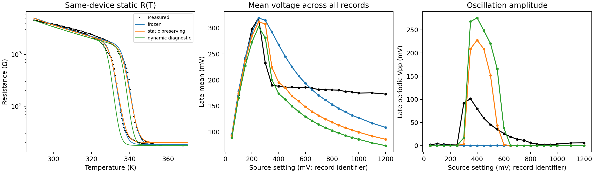
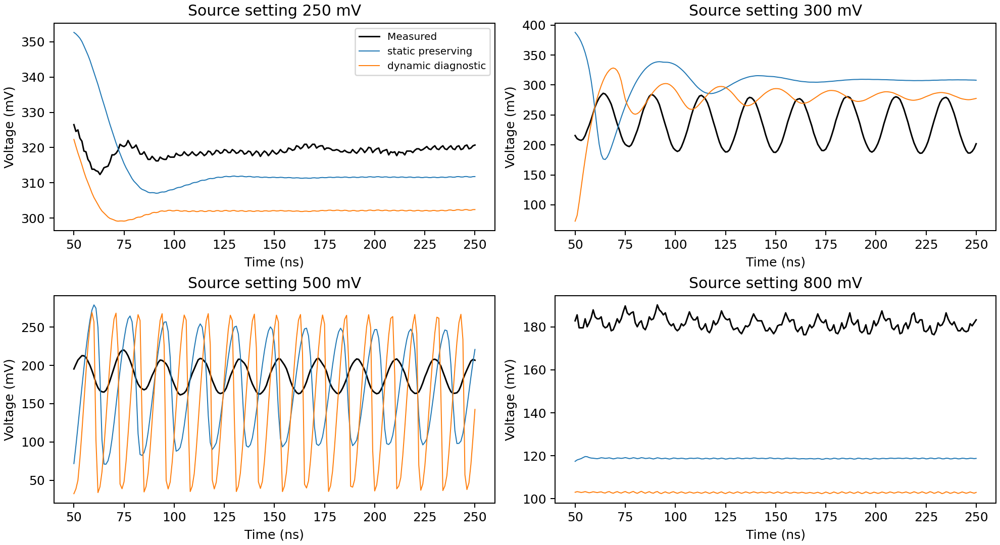

# Budgeted joint resistance and waveform fit — 21 September 2026

**Result:** freeing all resistance parameters produces a better continuous
feature score, but the bounded search does not produce a satisfactory shared
physical fit. The best static-preserving candidate reduces amplitude errors
relative to the prior anchored fit while recovering fewer persistent oscillators.
No fitted vector replaces the specimen calibration.

## Design and compute budget

The [recipe](../experiments/current/specimen_joint_inference.toml) fits eleven
quantities: all six major-loop resistance parameters, gamma, ambient temperature,
electrical capacitance and two thermal quantities. Every candidate has one vector
shared across currents. The static loss uses the raw same-device R(T) loop, not
only the old parameter intervals. Gabriel confirmed device identity.

Positive scale parameters use log coordinates. `Rs_315K_ohm` replaces the strongly
correlated Arrhenius prefactor; the code derives `R0=Rs315*exp(-Ea_over_k/315)`.
`tau_th_ns` and conductance replace the correlated Cth/Se pair, with
`Cth[pJ/K]=Se[mW/K]*tau[ns]`. The physical equations and float32 hysteresis are
unchanged. Bounds are deliberately broader than the earlier conditional intervals.

Both objectives start from the same 24-point population: frozen, anchored and
historical amplitude-priority references, nearby perturbations, and feasible
Latin-hypercube candidates. Static RMSE above 0.35 log10 decades is screened
before simulation. Each search runs three differential-evolution generations
and a maximum of 24 Powell evaluations. Powell reuses SciPy already present;
no CMA-ES dependency, optimizer comparison campaign, agent delegation or remote
compute was needed. Both searches hit their caps, not a demonstrated optimum.

The actual budget was **240 objective calls, 214 unique candidates, 201 simulated
search candidates, and 152.6 seconds of search wall time** on this machine.
Each simulated candidate batches nine current records. Final verification is
additional: five shared vectors × three steps × all 22 currents.

Training source labels: **100, 250, 300, 350, 500, 650, 800, 900, 1200 mV**.
These labels identify files; the input is measured current in µA. The other
thirteen records are excluded from optimizer evaluations. They have been seen
in prior project work, so this is validation rather than a pristine blind test.
The complete pre-pulse history is retained. The unused post-250 ns tail is omitted.

## Loss and interpretation

For each training trace, compare four 50 ns windows over 50–250 ns:

`Lwave = Lmean + 3 Lamp_periodic + Lamp_robust + 0.5 Lfrequency`.

Mean errors are squared after dividing by 20 mV. Amplitude errors use squared
log ratios with a 3 mV additive floor. Frequency errors use a 10 MHz scale,
only for measured persistent oscillators; predicted amplitude and coherence
smoothly gate that term. Missing oscillations remain penalized by amplitude.
The four-window comparison penalizes decay without a discontinuous binary
classification reward. Persistence is independently checked with the existing
audit thresholds, not used as the sole optimization target.

`Ltotal = mean(Lwave) + lambda_R * (RMSE_log10_R / 0.05)^2`.

`lambda_R=4` is the static-preserving objective and `0.15` is the dynamic
diagnostic. These scales are explicit engineering preferences, not likelihoods
or independent parameter confidence intervals. A candidate outside the resistance
temperature domain is penalized. Static-preserving here means a strong penalty;
it does not guarantee the original static fit quality.

At the 0.05 ns search step, each winner improved its own total score over the
best common starting candidate by **15.1%** and **18.7%**, respectively. Scores
from the two differently weighted objectives must not be compared directly.

## Results at 0.00625 ns

Every candidate below was freshly replayed using the same current histories and
metrics. Mean error uses all 22 late means (150–250 ns). Amplitude error uses
late sinusoidal periodic Vpp on exactly the same 11 measured persistent records;
this differs from historical raw-Vpp summaries.

| Candidate | Static log10 RMSE | Mean-voltage RMSE (mV) | Periodic-amplitude MAE on 11 oscillators (mV) | Recovered / 11 | False positives |
|---|---:|---:|---:|---:|---:|
| Frozen | 0.0366 | 45.3 | 44.3 | 0 | 0 |
| Prior anchored, replayed | 0.0426 | 50.9 | 140.1 | 9 | 0 |
| Prior amplitude-priority, replayed | 0.3203 | 136.4 | 68.5 | 11 | 3 |
| Joint static-preserving | 0.0495 | 50.5 | 62.0 | 4 | 0 |
| Joint dynamic diagnostic | 0.1433 | 60.2 | 90.3 | 5 | 0 |

The static-preserving fit lowers amplitude error relative to anchored by 55.7%,
but loses five of its nine detections. The frozen model has smaller absolute
amplitude MAE while predicting no sustained cycles; this illustrates why no one
scalar metric should define success.

| Candidate | Training feature score (9 currents) | Validation feature score (13 currents) |
|---|---:|---:|
| Frozen | 23.16 | 14.80 |
| Prior anchored | 12.23 | 15.16 |
| Joint static-preserving | 12.43 | 10.07 |
| Joint dynamic diagnostic | 14.25 | 16.18 |

The static-preserving validation score improves 33.5% over anchored. Its fine-step
training waveform score is slightly worse than anchored even though its coarse
search objective improved. Refinement therefore matters for ranking as well as
waveform shape. The diagnostic fit pays a large static-data cost and does not
beat the static-preserving fit on fine-step validation; it is not preferred.





The [parameter table](../public_jobs/20260921_130032_budgeted-joint-resistance-and-waveform-inference_6b5d8f/parameters.csv)
records full precision. Static-preserving gives C=6.806 pF, Se=3.738 µW/K,
Cth=0.05928 pJ/K and gamma=0.1757; the diagnostic gives C=4.964 pF,
Se=3.519 µW/K, Cth=0.03970 pJ/K and gamma=0.1787. Both again favor C well
above the conditional 0.39 pF timing estimate. This recurrence does not establish
that these are intrinsic device capacitances.

## Refinement and limits

All five vectors were tested at 0.025, 0.0125 and 0.00625 ns. Between the last
two steps, the static-preserving fit changes any late mean by at most 0.339 mV.
For records persistent at both steps, maximum periodic-amplitude and frequency
changes are 2.52% and 0.16%. It recovers four records at all three verification
steps. The diagnostic changes late means by up to 4.04 mV; its two fine steps
recover five records, versus six at 0.025 ns. Its persistent-record amplitude
and frequency changes are 1.95% and 0.44%. Boundary/transient convergence remains
less secure than the persistent interior. The historical seeds also exhibit
timestep sensitivity; their original reported labels are not substituted for
these replayed measurements.

This limited search did not establish parameter identifiability, a global
minimum, or impossibility of a successful joint fit. It also did not test a new
circuit or filament model. Longer-duration simulations were not added to this
budget: extrapolating measured currents beyond the supplied pulse would test a
different input. Persistence is conditional on the measured 300 ns records.

The result is a quantitative tradeoff: a better continuous score does not yet
recover the correct operating window and means. Preserve the candidates and
follow the channel/impedance and dynamic switching measurements in the
[discrepancy audit](DISCREPANCY_AUDIT_20260921.md) before assigning physical meaning
to effective fitted parameters. No further broad search was launched.

## Reproduction and presentation

```bash
neuristor analyze fit-joint --config experiments/current/specimen_joint_inference.toml
pytest -q
neuristor validate
```

The immutable [bundle report](../public_jobs/20260921_130032_budgeted-joint-resistance-and-waveform-inference_6b5d8f/report.md)
links its numerical tables through the manifest. It includes source snapshots,
input/source hashes, bounds, budget, every objective call and separate validation
metrics. The command creates a new bundle rather than modifying this evidence.

The requested [presentation](../Simulations_on_VO2/main.pdf) retains its title,
author, laboratory and supervisors. Three method slides and five result slides
were added before the closing baseline slide; editable result source is
`Simulations_on_VO2/joint_fit_results.tex`. Full suite: 64 tests passed.
