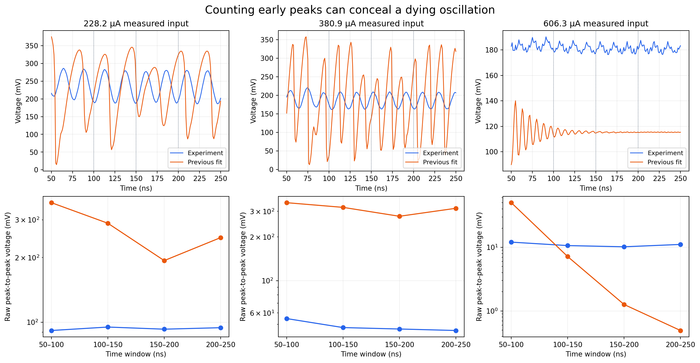
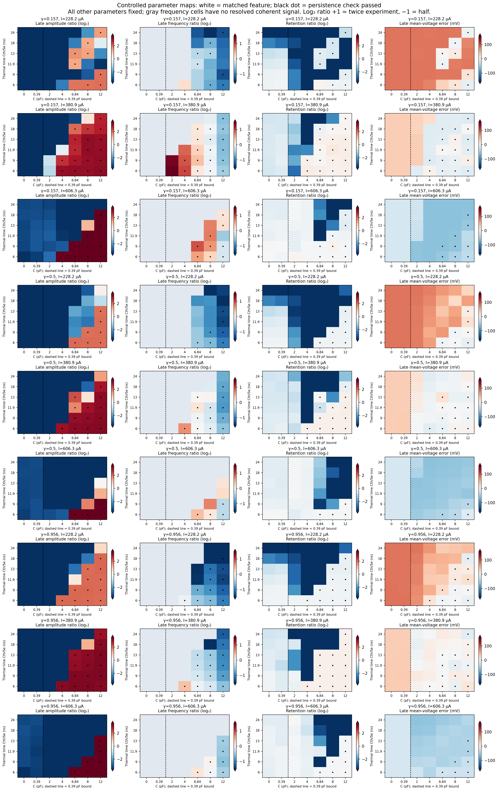
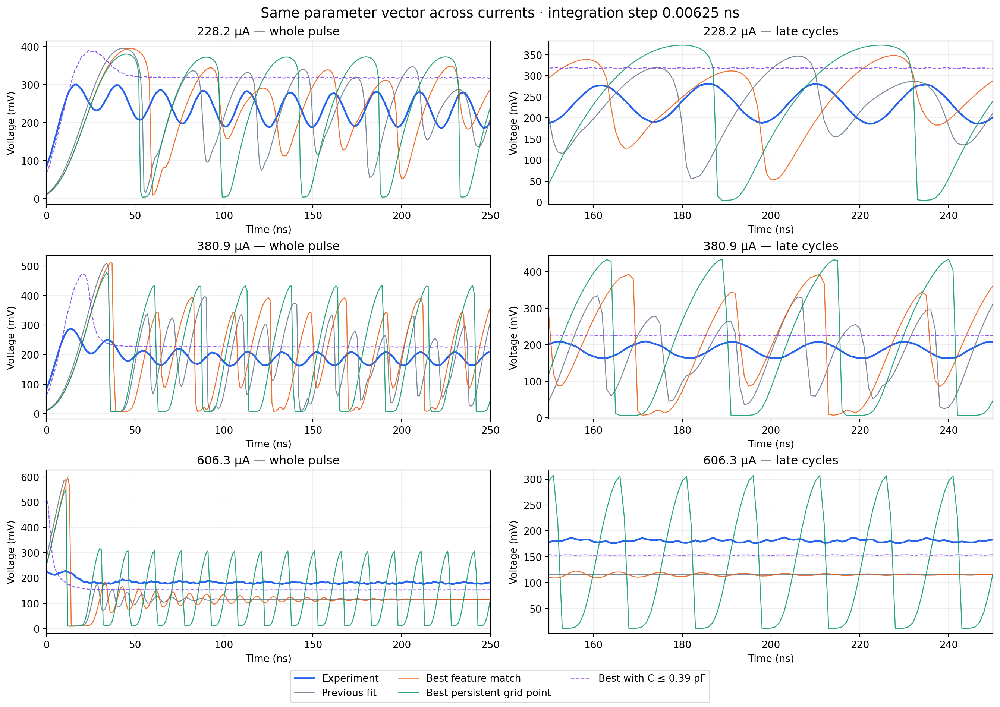

# Sustained-oscillation audit and controlled parameter maps

The prior peak-count classification is not evidence of sustained oscillation. It accepts 11 reference traces; the window audit accepts 10. The same window audit accepts 11 experimental traces.

## Method

Four windows cover 50–100, 100–150, 150–200 and 200–250 ns. Each reports raw and 5–95% voltage spans, mean voltage and sinusoidal amplitude. A Hann spectrum on 150–250 ns locates the dominant component in 10–200 MHz, followed by local sinusoidal regression with a fitted baseline slope. The 100 ns record has about 10 MHz Fourier-bin spacing: interpolation does not create additional experimental resolution. A separate peak-period estimate has no 8 ns minimum spacing. Frequencies of flat/noisy signals are descriptive only and are excluded from the error term.

A trace passes the operational persistence check when every window has at least 6 mV fitted fundamental Vpp, the last/first robust span is at least 0.5, and the late fundamental explains at least 40% of detrended variance. These thresholds are not physical constants; threshold_sensitivity.csv repeats the audit at 4/6/8 mV and retention 0.25/0.5/0.75. A finite record cannot prove a limit cycle.

The maps replay the measured current waveforms at three settings (300, 500, 800 mV source labels; approximately 228, 381, 606 uA measured currents). They vary electrical C and thermal time Cth/Se at several gamma values. All other quantities are fixed to the archived reference fit. Cth is calculated from Se times thermal time, with explicit pJ/K units in parameter_map.csv. This is a conditional slice, not an exhaustive search over eight parameters. C above 0.39 pF remains an exploratory violation of the prior timing estimate.

Each candidate is ranked by equal-weight squared errors scaled to 20% amplitude ratio (with a 3 mV floor), 10% frequency, 20 mV mean voltage, and factor-two retention. There is no large binary classification reward. These are engineering scales, not measurement uncertainties. The best score, best score passing all three persistence checks (if any), and best score within the C timing bound are verified, along with the reference. No fit is selected independently per current.

## Results

Mapped 126 shared combinations; 14 pass persistence at all three currents.

| Candidate | Step (ns) | Sustained | Misses | False positives | Feature score on measured oscillators |
|---|---:|---:|---:|---:|---:|
| best_features | 0.00625 | 10 | 1 | 0 | 30.040 |
| best_features | 0.0125 | 10 | 1 | 0 | 30.230 |
| best_features | 0.025 | 10 | 1 | 0 | 30.939 |
| best_sustained | 0.00625 | 12 | 0 | 1 | 46.148 |
| best_sustained | 0.0125 | 12 | 0 | 1 | 46.259 |
| best_sustained | 0.025 | 12 | 0 | 1 | 46.447 |
| best_timing_bound | 0.00625 | 0 | 11 | 0 | 63.586 |
| best_timing_bound | 0.0125 | 0 | 11 | 0 | 63.421 |
| best_timing_bound | 0.025 | 0 | 11 | 0 | 63.309 |
| reference | 0.00625 | 9 | 2 | 0 | 29.497 |
| reference | 0.0125 | 9 | 2 | 0 | 30.140 |
| reference | 0.025 | 10 | 1 | 0 | 30.952 |

All 22 currents are checked at each listed step. The other currents are cross-current checks, not pristine blind validation: earlier development already inspected these data. Parameter choices and per-current convergence metrics are archived. Identical labels alone do not establish waveform convergence. Historical bundles and their objective are unchanged; this audit supplies the corrected interpretation.

