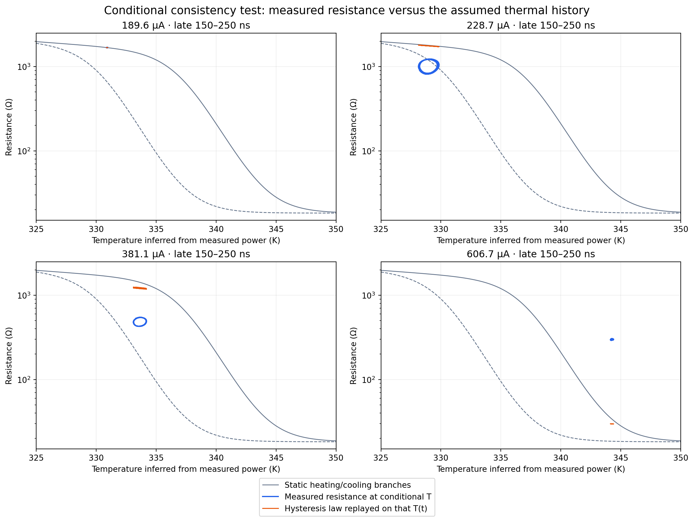

# Conditional reconstruction of the driven resistance law

The measured channels are baseline corrected and smoothed with a five-point quadratic Savitzky–Golay filter (one sensitivity case uses nine points). The existing thermal-analysis implementation computes I_R = I - C dV/dt, R_eff = V/I_R and P = V I_R. Its exact piecewise-linear-power integrator then calculates T(t) from Cth dT/dt = P - Se(T-T0), starting at T0 at -200 ns.

The authoritative Yuanhang hysteresis law is replayed on this prescribed temperature history. This tests its resistance response without asking an optimizer to repair a forward waveform. Temperature is conditional on the assumed lumped thermal balance, channel interpretation and parameter values; it is not an independent thermometer. Static R(T) is not used to reconstruct T.

Sensitivity cases change C, Se, Cth or smoothing one at a time. They are not a joint confidence region. Gamma is scanned with the major-loop parameters fixed. Replays at 1, 0.5 and 0.25 ns test hysteresis sampling; the measured channels remain sampled at 1 ns. All 22 currents are included, and gamma is ranked by mean log-resistance RMSE on the 11 original oscillators.

The table uses 150–250 ns, the central C=0.39 pF case and Yuanhang gamma. Invalid nonpositive resistive current and excursions outside the resistance temperature range are explicitly reported in reconstruction.csv.

| Current (uA) | Conditional mean T (K) | Measured mean R (ohm) | Replayed mean R (ohm) |
|---:|---:|---:|---:|
| 189.6 | 330.91 | 1680.6 | 1679.2 |
| 228.7 | 328.96 | 1017.9 | 1762.5 |
| 381.1 | 333.64 | 488.4 | 1215.1 |
| 606.7 | 344.25 | 298.2 | 29.7 |

A mismatch identifies a conflict among the constitutive law, thermal model, parameters and measured-channel interpretation; it does not uniquely identify which assumption is wrong. A good conditional gamma score would still require independent forward validation.

